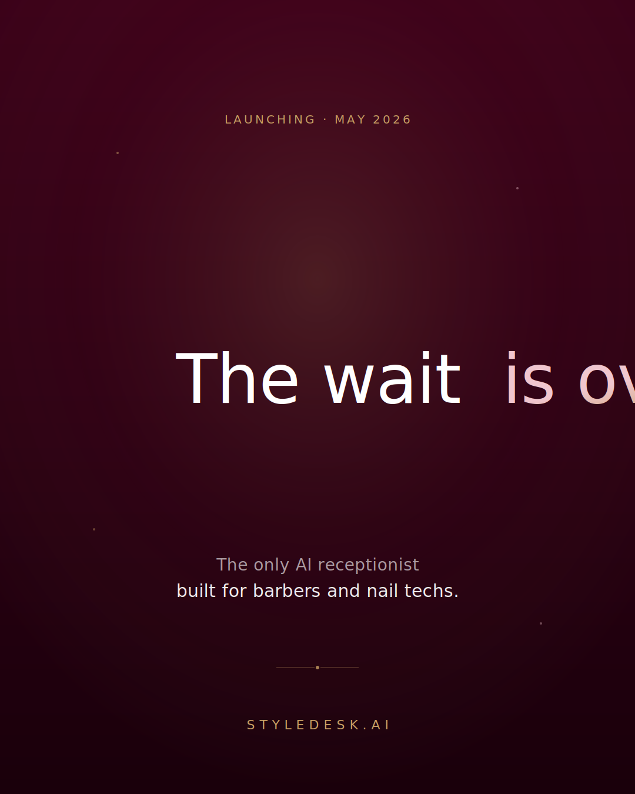
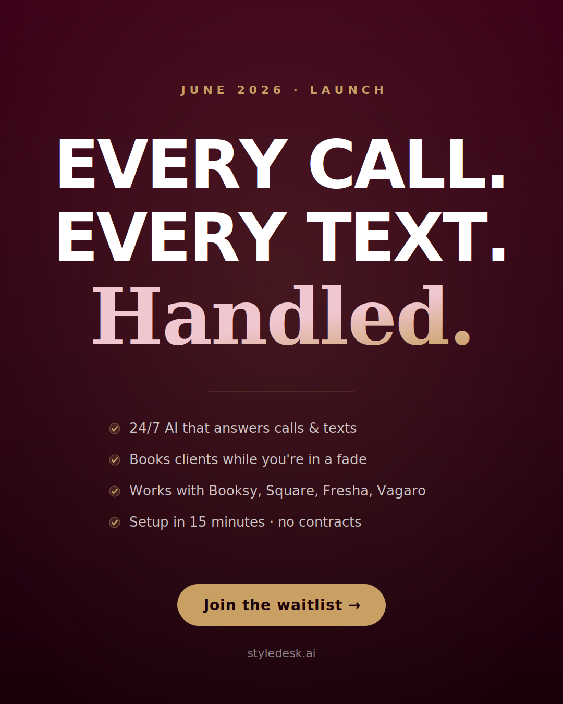
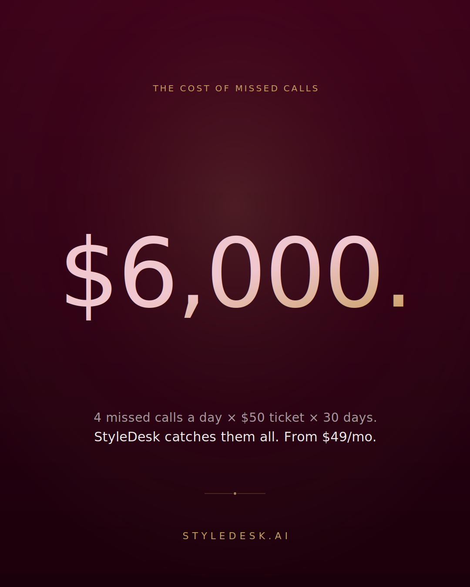
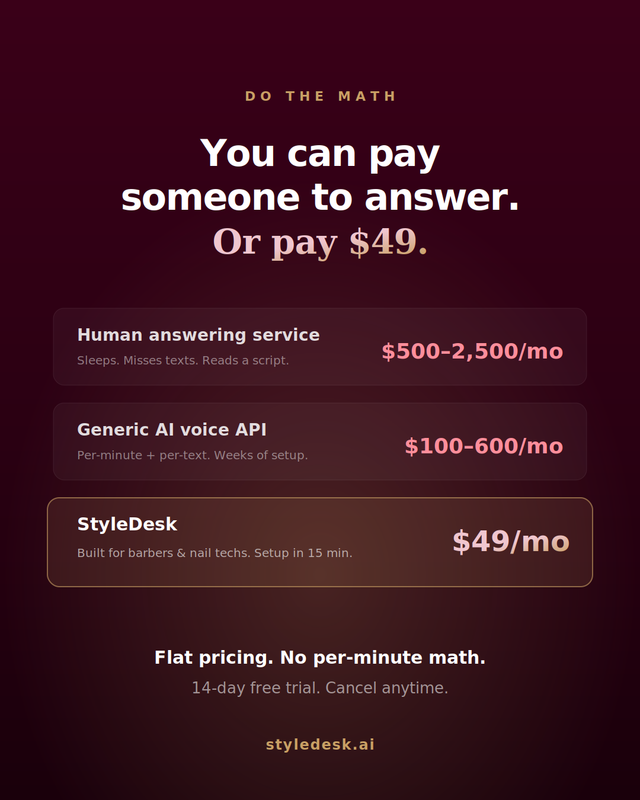
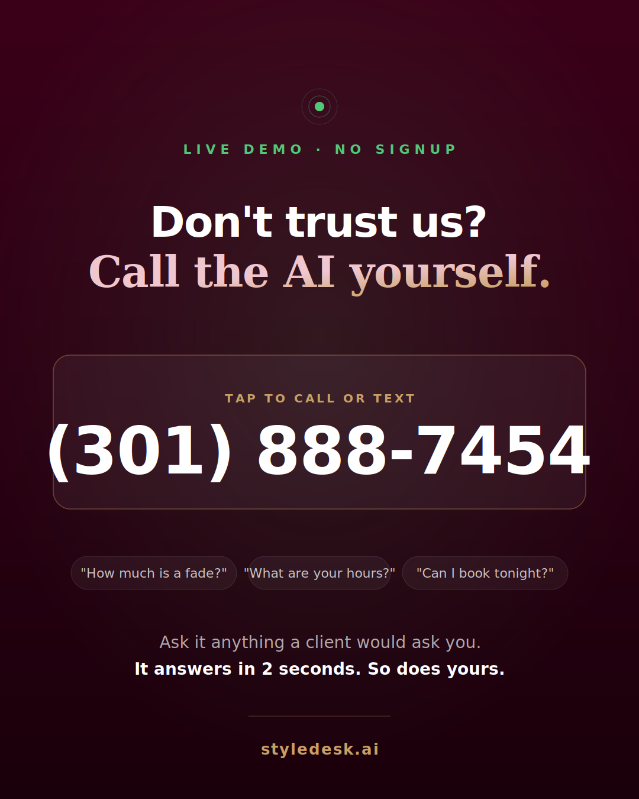

# StyleDesk — Next 3 Instagram Posts

Three posts, pulled from your landing page language and brand (burgundy → gold, "Every Call. Every Text. Handled."). Each post has a visual mockup, a caption, and hashtags. Where I had two good directions, I gave you options.

All mockups are 1080×1350 (Instagram 4:5 portrait). Tap any SVG to fullscreen it.

---

## Post 1 — Launching in May

**Goal:** Create anticipation. Short, bold, "something is coming."
**Post type:** Single image (or Reel cover).
**Best time to post:** Early May, then repost as a Story 2–3 days before go-live.

### Option A — "It's finally happening." (recommended)
Clean, premium, quietly confident. Matches your Playfair italic + gold-gradient treatment on the site.

### Option B — Teaser with feature bullets
Louder. Stacks your hero line with 4 quick proof points and a waitlist CTA. Use this if you want direct-response energy instead of anticipation.

### Caption (use with either option)
> It's been 18 months in the making.
>
> The AI receptionist built **only** for barbers and nail techs goes live this May.
>
> No more missed calls at 9pm. No more "sorry I was with a client." No more losing a $75 fade because you were mid-fade.
>
> StyleDesk answers every call and every text, 24/7 — and sends clients a booking link to your Booksy, Square, Fresha, or Vagaro.
>
> Setup takes 15 minutes. First 14 days are free.
>
> Link in bio → waitlist opens this week. 🔗

### Hashtags
`#barberlife #barbershop #nailtech #nailsalon #barbertools #salonowner #barbershopconnect #smallbusinessowner #shopowner #aiforbusiness #barbersince #nailpro #nailboss #salonlife #barberworld`

---

## Post 2 — Why people should buy (with stats)

**Goal:** Hit the wallet. Make the cost of doing nothing obvious.
**Post type:** Single image, or carousel (pair both options as slides 1 and 2).

### Option A — The math of missed calls (recommended)
One number does the work. Defensible math (your own ticket × conservative missed-call count).

> **Why this works:** People scroll past "better service" but they stop for "$6,000." The math is shown so no one can accuse you of making it up — 4 missed calls × $50 × 30 days. Then the flip: StyleDesk is $49.

### Option B — Head-to-head price comparison
Uses the same scenario cards from your pricing page. Great as slide 2 of a carousel after Option A.

### Caption (works for either, or a carousel of both)
> Let's do the math you've been avoiding 👇
>
> The average shop misses **4 calls a day**. Average ticket is $50. That's **$6,000/month** walking out the door while you're mid-fade or mid-set.
>
> A human answering service? $500–2,500/mo — and they sleep.
> Generic AI (Bland, Vapi, etc)? $100–600/mo — and takes weeks to set up.
> **StyleDesk? $49/mo.** Built for YOUR industry. Knows "shape-up," "skin fade," "gel mani," "dip powder" out of the box. 24/7. No contracts.
>
> 14-day free trial. Cancel from your dashboard in 2 taps.
>
> Link in bio 🔗

### Hashtags
`#barberbusiness #salonbusiness #smallbusinesstips #entrepreneurlife #barbershoplife #salonowner #nailsalonowner #bookedandbusy #aitools #businessgrowth #nailtechlife #barberpreneur #shopowner #missedcalls #salonmarketing`

---

## Post 3 (bonus) — "Call the AI yourself"

**Goal:** Proof. Let the product sell itself.
**Post type:** Single image + a Reel of you actually calling the number (30s).

### Why I'm suggesting this as your 3rd post
After a launch tease and a stats/price post, the natural follow-up is **proof**. Your landing page already has a live demo number — (301) 888-7454 — that anyone can call. Put that number on a post and tell people to call it. Nothing sells AI receptionist like hearing the AI receptionist.

### Caption
> Don't trust marketers. Trust the product.
>
> Pick up your phone RIGHT NOW and call **(301) 888-7454**.
>
> Ask it how much a fade is. Ask what our hours are. Ask if you can book for Saturday.
>
> That's StyleDesk. That's what your clients hear when YOU can't pick up.
>
> 2-second response time. No hold music. No "press 1 for…" menu. Just answers.
>
> $49/mo. Link in bio.

### Hashtags
`#aiassistant #barbertech #salontech #barberinnovation #nailsalonlife #bookedbarber #barberconnect #nailsnailsnails #barbershoptalk #smallbizowner #nailsoftheday #barbergram #aivoice #tryitnow`

---

## Posting order I'd recommend

1. **Early May** — Post 1 (launch tease, Option A). Anticipation.
2. **~5 days later** — Post 3 (live demo call). Proof of the product working.
3. **~5 days after that** — Post 2 (the math). Close the sale.

That sequence = hook → proof → urgency. Works better than leading with price.

---

## Notes on visuals

- All mockups use your brand: burgundy gradient (#3a0018 → #1a000b), gold (#c9a064), pink accent (#f0c6cf), Playfair italic for hero words, Inter for UI, DM Mono for numbers.
- Swap `styledesk.ai` for your real handle (`@styledesk.ai`?) at the bottom if different.
- If you want these as PNGs for posting, open the SVG in any browser and screenshot, or I can render them to PNG — just say the word.
