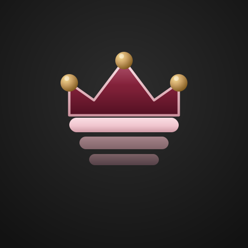
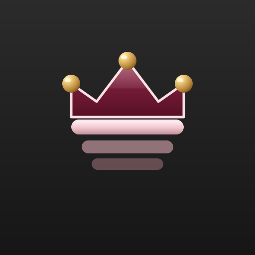
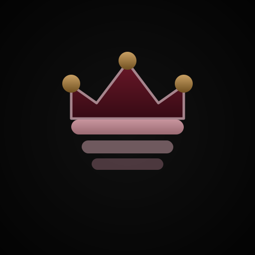
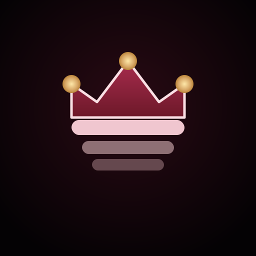

# StyleDesk Logo — Premium Treatment Options

Same exact geometry as your current logo (crown shape, bar stack, gold-dot positions, dark square background). Only the materials and lighting change. Pick one and I'll make it the master.

---

## A — Jeweler's Crown
**Real metal feel.** Gold dots look like polished beads with tiny white catch-lights. Crown has a subtle top-to-bottom gradient (brighter maroon → deep burgundy). Pink stroke shifts from highlight to shadow. Soft drop-shadows under every element. The pink bar has dimensional shading.

**When it wins:** boutique, jewelry-store-premium. Most "expensive" feel without being loud.

---

## B — Glass Royal
**iOS-app-store polish.** Every surface has a glossy overlay — white highlight on top half of crown, bright gloss strip on pink bar, pronounced white specular on gold dots. Feels like a button you want to tap.

**When it wins:** tech/SaaS audience. Reads as a software product. Strongest "app" vibe.

---

## C — Heraldic Seal
**Engraved, antiqued, moody.** Deeper blacks, desaturated gold (more bronze than gold), dusty-rose bars instead of bright pink. Subtle inner shadow on the crown for an embossed/stamped-in-wax feel. Low-key.

**When it wins:** barbershop-heritage/old-world vibe. Feels like a craftsman's mark rather than an app.

---

## D — Gold Glow
**Luminous / neon-luxe.** Gold dots emit a warm halo. Pink edges of the crown feel lit from within. Background darker than the others so the glow pops harder. Most "pops on feed" option.

**When it wins:** nightlife / high-end salon energy. Strongest stop-the-scroll pull at thumbnail size.

---

## How to decide

- **Strongest social recognition at tiny sizes (40–80px feed profile pic):** D (glow) — the bright gold halos carry even at 32px
- **Most "product company" polish:** B (glass)
- **Most "timeless luxury brand":** A (jeweler) — my pick for a lasting mark
- **Most distinctive voice / industry-coded:** C (heraldic) — speaks barber-shop tradition

Reply with A/B/C/D and I'll promote it to `styledesk-logo-square.svg` and wire the favicon to match.
